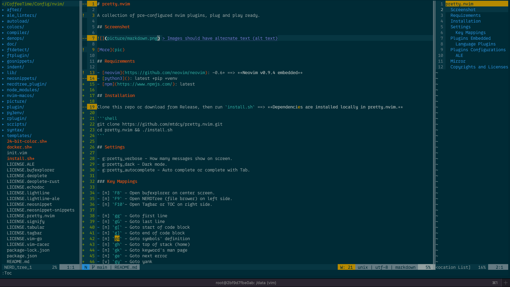

# pretty.nvim

A collection of pre-configured nvim plugins, plug and play ready.

## Screenshot



[More](pic)

## Requirements

- [neovim](https://github.com/neovim/neovim): ~0.6+ ==> **Neovim v0.9.4 embedded**
- [python3](): latest +pip +venv
- [npm](https://www.npmjs.com/): latest

## Installation

Clone this repo or download from Release, then run `install.sh` ==> **Dependencies are installed locally in pretty.nvim.**

```shell
git clone https://github.com/mtdcy/pretty.nvim.git
cd pretty.nvim && ./install.sh
```

## Settings

- g:pretty_verbose - How many messages show on screen.
- g:pretty_dark - Dark mode.
- g:pretty_autocomplete - Auto complete or complete with Tab.

### Key Mappings

- [n] `F8` - Open bufexplorer on center screen.
- [n] `F9` - Open NERDTree (file brower) on left side.
- [n] `F10`- Open Tagbar or TOC on right side.

- [n] `gg` - Goto first line
- [n] `gG` - Goto last line
- [n] `g[` - Goto start of code block
- [n] `g]` - Goto end of code block
- [n] `gd` - Goto symbols' definition
- [n] `gh` - Goto top of stack (home)
- [n] `gk` - Goto keyword's man page
- [n] `ge` - Goto next error
- [v] `gy` - Goto yank
- [n] `gp` - Goto paste
- [n] `gl` - Goto loclist
- [n] `gf` - Go forward (page down)
- [n] `gb` - Go backward (page up)

- [v] `/` -- Tabularize

## Plugins Embedded

- [solarized8](https://github.com/lifepillar/vim-solarized8)@bde9cab3d
- [bufexplorer](https://github.com/jlanzarotta/bufexplorer)@7.4.26
- [NERDTree](https://github.com/preservim/nerdtree)@7.0.0
- [Tagbar](https://github.com/preservim/tagbar)@3.1.1
- [echodoc.vim](https://github.com/Shougo/echodoc.vim)@8c7e99e
- [vim-signify](https://github.com/mhinz/vim-signify/tree/master)@7d538b7
- [ALE](https://github.com/dense-analysis/ale)@3.3.0
- [deoplete.nvim](https://github.com/Shougo/deoplete.nvim)@62dd019
- [Neosnippet](https://github.com/Shougo/neosnippet.vim)@efb2a615d
  - [neosnippet-snippets](https://github.com/Shougo/neosnippet-snippets)@725c989f1
- [lightline.vim](https://github.com/itchyny/lightline.vim)@1c6b455c0
  - [lightline-ale](https://github.com/maximbaz/lightline-ale)@a861f691a
- [fugitive](https://github.com/tpope/vim-fugitive)@46eaf8918
- [Tabular](https://github.com/godlygeek/tabular)@339091ac4
- [vim-markdown](https://github.com/preservim/vim-markdown)@46add6c30

### Language Plugins

- Go: [vim-go](https://github.com/fatih/vim-go)@973279275 - `:GoInstallBinaries`
- Rust: [vim-racer](https://github.com/racer-rust/vim-racer)@d1aead98a

## Plugins Configurations

### ALE

- Vim
  - [vimls](https://github.com/iamcco/vim-language-server) - `npm install vim-language-server`
- Sh
  - [shellcheck](https://github.com/koalaman/shellcheck) - `npm install shellcheck`
  - [shfmt](https://github.com/mvdan/sh) - `go install mvdan.cc/sh/v3/cmd/shfmt@latest`
- Go
  - [gopls]() - `go install golang.org/x/tools/gopls@latest`
  - [goimports]() - `go install golang.org/x/tools/cmd/goimports@latest`
- Rust
  - [cargo|rustc](https://www.rust-lang.org) - [Installation](https://www.rust-lang.org/tools/install)
  - [rustfmt]() - `rustup component add rustfmt`
- C/C++
  - [gcc]() or [clang]()
  - [clang-format]() - `npm install clang-format` - [参数](https://clang.llvm.org/docs/ClangFormatStyleOptions.html)
- CMake
  - [cmakelint]() - `pip3 install cmakelint`
  - [cmake-format]() - `pip3 install cmake-format`
- Dockerfile
  - [haoolint](https://github.com/hadolint/hadolint) - `brew install hadolint`
  - [dprint](https://dprint.dev/) - `npm install dprint`
- Html
  - [htmlhint](https://github.com/htmlhint/HTMLHint) - `npm install htmlhint`
    - [.htmlhintrc](.htmlhintrc)
  - [prettier]() - `npm install prettier`
    - [.prettierrc](.prettierrc), [.prettierignore](.prettierignore)(use .gitignore syntax)
- Java
  - [javac]()
  - [clang-format]()
- JavaScript
  - [eslint]() - `npm install eslint`
    - [.eslintrc](.eslintrc)
  - [prettier-eslint](https://github.com/prettier/prettier-eslint-cli) - `npm install prettier-eslint-cli`
- Json
  - [jsonlint](https://github.com/zaach/jsonlint) - `npm install jsonlint`
  - [clang-format]()
- Markdown - [Rules](https://github.com/DavidAnson/markdownlint#rules--aliases)
  - [markdownlint](https://github.com/igorshubovych/markdownlint-cli) - `npm install markdownlint-cli`
    - [.markdownlint.yaml](.markdownlint.yaml)
  - [prettier](https://prettier.io/) - `npm install prettier`
- Yaml
  - [yamllint](https://github.com/adrienverge/yamllint) - `pip3 install yamllint`
  - [yamlfix](https://github.com/lyz-code/yamlfix) - `pip3 install yamlfix`
- Python
  - [pylint]() - `pip3 install pylint`
  - [autopep8](https://pypi.org/project/autopep8) - `pip3 install autopep8`

## Mirror

- [CN](https://git.mtdcy.top:8443/mtdcy/pretty.nvim.git)
- [PR](https://github.com/mtdcy/pretty.nvim.git)

## Copyrights and Licenses

- Files merged from other projects follow their own licenses.
- Files belonging to this project(mainly top-level files) are licensesd under the [BSD-2-Clause](LICENSE).
