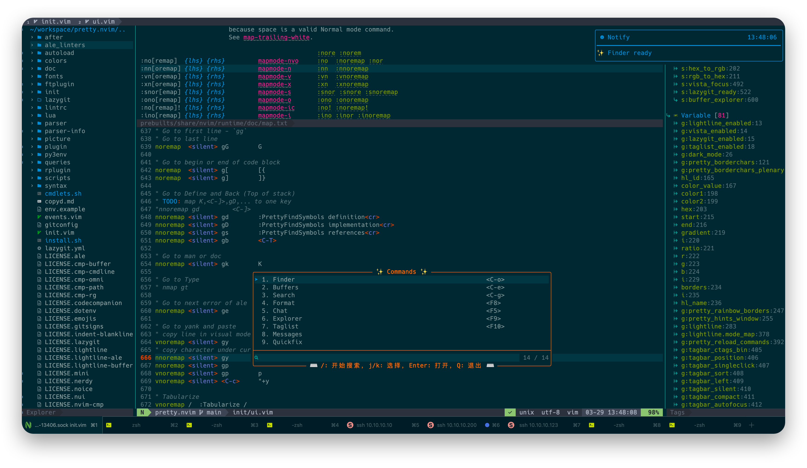

# pretty.nvim

A collection of pre-configured nvim plugins, plug and play ready.

## UI / TermUI



[More](picture)

## Requirements

- [neovim](https://github.com/neovim/neovim): ~0.6+ ==> **Neovim v0.10.3 embedded**
- [python3](): latest +pip +venv ==> **python3.13 won't work**
- [npm](https://www.npmjs.com/): latest

## Quick Start

```shell
# Github
bash -c "$(curl -fsSL https://raw.githubusercontent.com/mtdcy/pretty.nvim/main/install.sh)" install
# CN
bash -c "$(curl -fsSL http://git.mtdcy.top/mtdcy/pretty.nvim/raw/branch/main/install.sh)" install
```

==> **Dependencies are installed locally in pretty.nvim.**

## Features

- Preconfigured plugins and support/host binaries & neovim installer.
- Linters & checkers & conf templates.
- Sticky buffer for sidebars.
- Seamless buffer switch with `C-n` & `C-p`, even in terminal mode.
- Smart window & buffer close with `C-q`.
- Full functional bufferline with mouse clickable.
- Support copy text back from ssh session, [copyd](copyd.md)

## Settings

- g:pretty_verbose      - How many messages show on screen.
- g:pretty_dark         - Dark mode.
- g:pretty_autocomplete - Auto complete or complete with Tab.

### Key Mappings

Since mouse works even in terminal, you don't have to remember these key mappings.

> There are only a few that cannot be done with the mouse, which marked as '[*]'.

#### Windows

[x] Prefer using `C-q` instead of `:quit` or `:close`, as it is smarter.

- [n] `F8` - Open bufexplorer on center screen. [*]
- [n] `F9` - Open NERDTree (file brower) on left side. [*]
- [n] `F10` - Open Tagbar or TOC on right side. [*]
- [n] `F12` - Open LazyGit window. [*]

- [n] `C-h` - Move focus to left window.
- [n] `C-l` - Move focus to right window.
- [n] `C-j` - Move focus to below window.
- [n] `C-k` - Move focus to up window.

- [n] `C-q` - Close windows and buffers, util the last one.

#### Buffers

- [n] `C-e` - Buffer Explorer
- [n] `C-n` - Buffer Next
- [n] `C-p` - Buffer Prev

- [n] `<leader>1` - Select buffer 1
- [n] `<leader>2` - Select buffer 2
- [n] `<leader>3` - Select buffer 3
- [n] `<leader>4` - Select buffer 4
- [n] `<leader>5` - Select buffer 5
- [n] `<leader>6` - Select buffer 6
- [n] `<leader>7` - Select buffer 7
- [n] `<leader>8` - Select buffer 8
- [n] `<leader>9` - Select buffer 9
- [n] `<leader>0` - Select buffer 10

#### About terminal buffers

```vim
:tnoremap <Esc> <C-\><C-N>
```

After this, everything works like insert and normal mode.

#### Goto/Jump

[ ] TODO: map `gd` `gk` `gD` to single key.

- [n] `gg` - Goto first line
- [n] `gG` - Goto last line
- [n] `g[` - Goto start of code block
- [n] `g]` - Goto end of code block
- [n] `gd` - Goto symbols' definition
- [n] `gh` - Goto top of stack (home)
- [n] `gk` - Goto keyword's man page
- [n] `ge` - Goto next error
- [v] `gy` - Goto yank
- [n] `gp` - Goto paste
- [n] `gl` - Goto loclist

#### Features

- [v] `/` - Tabularize

## Plugins Embedded

- Colors
  - [solarized8](https://github.com/lifepillar/vim-solarized8)@6178a07
- Explorer
  - [NERDTree](https://github.com/preservim/nerdtree)@f3a4d8e
  - [Denite](https://github.com/Shougo/denite.nvim)@055dd68
- Tags List
  - [Tagbar](https://github.com/preservim/tagbar)@12edcb5
- Status Line
  - [lightline.vim](https://github.com/itchyny/lightline.vim)@58c97bc
  - [lightline-bufferline](https://github.com/mengelbrecht/lightline-bufferline)@8206632
- Linter
  - [ALE](https://github.com/dense-analysis/ale)@6db58b3
  - [lightline-ale](https://github.com/maximbaz/lightline-ale)@a861f691a
- Completor
  - [deoplete.nvim](https://github.com/Shougo/deoplete.nvim)@43d7457
  - [echodoc.vim](https://github.com/Shougo/echodoc.vim)@8c7e99e
- VCS
  - [lazygit.nvim](https://github.com/kdheepak/lazygit.nvim)@0ada6c6
  - [vim-signify](https://github.com/mhinz/vim-signify/tree/master)@8670143
- Misc
  - [Tabular](https://github.com/godlygeek/tabular)@339091a
  - [rainbow](https://github.com/luochen1990/rainbow)@61f719a
  - [vim-matchtag](https://github.com/leafOfTree/vim-matchtag)@54357c0
  - [nerdcommenter](https://github.com/preservim/nerdcommenter)@e361a44

### Howto Add Plugins

I don't like plugin managers as I won't upgrade plugins frequently.

```shell
git remote add bufexplorer https://github.com/jlanzarotta/bufexplorer.git
git fetch bufexplorer
git merge bufexplorer/master --allow-unrelated-histories --no-commit --squash
git checkout HEAD -- README.md .gitignore   # keep ours files
git mv LICENSE LICENSE.bufexplorer          # keep their license file
git rm -rf <...>                            # delete unneeded
vim README.md                               # update README
git add README.md

git commit -m "merged bufexplorer"
git push origin main
```

Delete plugin with `git revert`

## Plugins Configurations

### ALE

> Try to use python to install packages, because nvim has a stronger dependence on python.

> No fixer unless it is the same as linter.

- Vim
  - [vimls](https://github.com/iamcco/vim-language-server) - `npm install vim-language-server`
- Sh
  - [shellcheck](https://github.com/koalaman/shellcheck) - `npm install shellcheck`
- Go
  - [gopls](https://pkg.go.dev/golang.org/x/tools/gopls) - `go install golang.org/x/tools/gopls@latest`
- Rust
  - [cargo|rustc](https://www.rust-lang.org) - [Installation](https://www.rust-lang.org/tools/install)
- C/C++
  - [clang-format]() - `pip3 install clang-format` - [参数](https://clang.llvm.org/docs/ClangFormatStyleOptions.html)
- Make
  - [checkmake](https://github.com/mrtazz/checkmake) - `go install github.com/mrtazz/checkmake/cmd/checkmake@latest`
- CMake
  - [cmakelint]() - `pip3 install cmakelint`
  - [cmake-format]() - `pip3 install cmake-format`
- Dockerfile
  - [haoolint](https://github.com/hadolint/hadolint) - `brew install hadolint`
  - [dprint](https://dprint.dev/) - `npm install dprint`
- Html
  - [htmlhint](https://github.com/htmlhint/HTMLHint) - `npm install htmlhint`
    - [.htmlhintrc](lintrc/htmlhintrc)
- Java
  - [javac]()
- JavaScript
  - [eslint]() - `npm install eslint`
    - [.eslintrc](lintrc/eslintrc)
- Json
  - [jsonlint](https://github.com/zaach/jsonlint) - `npm install jsonlint`
- Markdown - [Rules](https://github.com/DavidAnson/markdownlint#rules--aliases)
  - [markdownlint](https://github.com/igorshubovych/markdownlint-cli) - `npm install markdownlint-cli`
    - [.markdownlint.yaml](.markdownlint.yaml)
- Yaml
  - [yamllint](https://github.com/adrienverge/yamllint) - `pip3 install yamllint`
- Python
  - [pylint]() - `pip3 install pylint`

## Mirror

- [CN](https://git.mtdcy.top:8443/mtdcy/pretty.nvim.git)
- [PR](https://github.com/mtdcy/pretty.nvim.git)

## Copyrights and Licenses

- Files merged from other projects follow their own licenses.
- Files belonging to this project(mainly top-level files) are licensesd
  under the [BSD-2-Clause](LICENSE).
