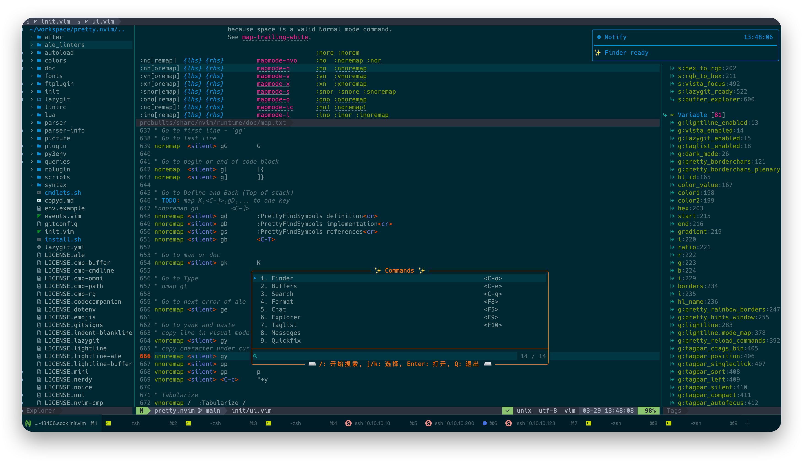

# pretty.nvim

> **Prebuilt Neovim + Well-tuned Plugins — Plug and Play Ready!**

[](LICENSE)
[](https://github.com/neovim/neovim)
[](#contributing)

**开箱即用的 Neovim 配置，预置精心调优的插件和工具链，5 分钟打造专业开发环境。**

---

## ✨ 核心特色

- 🚀 **即装即用** — 一键安装，无需复杂配置
- 📦 **预编译 Neovim** — 内置 nvim 0.11.6，避免版本兼容问题
- 🎨 **Solarized8 主题** — 经典配色，护眼高效
- 🔍 **输入增强** — 自动补全 + 输入法自动切换
- ⚡ **快速导航** — 标签列表、文件搜索、符号跳转
- 📝 **代码检查** — ALE 实时 linting，支持 50+ 语言
- 🔀 **版本控制** — LazyGit 集成，Git 操作可视化
- 🪟 **智能窗口** — 快捷键管理窗口和缓冲区
- 📋 **粘贴增强** — SSH 会话也能完美粘贴
- 🎯 **鼠标友好** — 终端下也能点击操作

---

## 📸 界面预览



更多截图：[picture/](picture)

---

## 🚀 快速开始

### 一键安装

```bash
# GitHub (国际)
bash -c "$(curl -fsSL https://raw.githubusercontent.com/mtdcy/pretty.nvim/main/install.sh)"

# 国内镜像 (推荐)
bash -c "$(curl -fsSL https://git.mtdcy.top/mtdcy/pretty.nvim/raw/branch/main/install.sh)"
```

### 升级配置

```bash
nvim --update
```

### 验证安装

```bash
# 启动 nvim
nvim

# 检查版本
nvim --version

# 测试插件加载
nvim -c 'echo "Plugins loaded!"' -c 'quit'
```
---

## 📋 系统要求

| 组件 | 版本 | 说明 |
|------|------|------|
| **Neovim** | 0.11.6 (内置) | 预编译版本，无需单独安装 |
| **Python3** | 3.8+ | 用于 LSP 和补全插件 |
| **Node.js** | 18+ | 用于 LSP 和补全插件 |
| **Git** | 2.0+ | 版本控制和插件更新 |
| **curl** | 任意 | 下载安装脚本 |

---

## ⌨️ 核心快捷键

> 💡 **提示**: 鼠标在终端中也可用，不记得快捷键可以直接点击操作！

### 🔍 Finder/搜索

| 快捷键 | 功能 | 模式 |
|--------|------|------|
| `Enter` | 打开 Finder 窗口 | n |
| `C-o` | 打开文件搜索 | n, i |
| `C-e` | 打开缓冲区列表 | n, i |
| `C-g` | 打开符号搜索 | n, i |
| `F9` | 打开文件树 | n, i |
| `F10` | 打开符号列表 | n, i |


### 🪟 窗口管理

| 快捷键 | 功能 | 模式 |
|--------|------|------|
| `C-h` | 左移窗口 | n |
| `C-j` | 下移窗口 | n |
| `C-k` | 上移窗口 | n |
| `C-l` | 右移窗口 | n |
| `C-n` | 下一个窗口 | n |
| `C-p` | 上一个窗口 | n |


### 📝 其他操作

| 快捷键 | 功能 | 模式 |
|--------|------|------|
| `gd` | 跳转到定义 | n |
| `gs` | 查找引用 | n |


---

## 🛠️ 预置插件

### 核心插件（33 个）

#### 补全引擎
- **[nvim-cmp](https://github.com/hrsh7th/nvim-cmp)** — 自动补全引擎
- **[cmp-buffer](https://github.com/hrsh7th/cmp-buffer)** — 缓冲区补全
- **[cmp-cmdline](https://github.com/hrsh7th/cmp-cmdline)** — 命令行补全
- **[cmp-nvim-lsp](https://github.com/hrsh7th/cmp-nvim-lsp)** — LSP 补全
- **[cmp-omni](https://github.com/hrsh7th/cmp-omni)** — Omni 补全
- **[cmp-path](https://github.com/hrsh7th/cmp-path)** — 路径补全
- **[cmp-rg](https://github.com/hrsh7th/cmp-rg)** — ripgrep 补全

#### 代码检查
- **[ALE](https://github.com/dense-analysis/ale)** — 异步代码检查
- **[lightline-ale](https://github.com/maximbaz/lightline-ale)** — ALE 状态栏集成

#### Git 集成
- **[gitsigns.nvim](https://github.com/lewis6991/gitsigns.nvim)** — Git 符号显示
- **[lazygit.nvim](https://github.com/kdheepak/lazygit.nvim)** — LazyGit 集成

#### 文件导航
- **[nvim-tree.lua](https://github.com/nvim-tree/nvim-tree.lua)** — 文件浏览器
- **[Telescope](https://github.com/nvim-telescope/telescope.nvim)** — 模糊搜索
- **[telescope-ui-select](https://github.com/nvim-telescope/telescope-ui-select.nvim)** — UI 选择器

#### 代码大纲
- **[outline.nvim](https://github.com/hedyhli/outline.nvim)** — 代码大纲
- **[outline-ctags-provider](https://github.com/hedyhli/outline-ctags-provider.nvim)** — ctags 支持

#### 界面美化
- **[solarized.nvim](https://github.com/nvim-solarized/solarized.nvim)** — Solarized 配色
- **[nvim-web-devicons](https://github.com/nvim-tree/nvim-web-devicons)** — 文件图标
- **[lspkind.nvim](https://github.com/onsails/lspkind.nvim)** — LSP 类型图标
- **[rainbow-delimiters.nvim](https://github.com/HiPhish/rainbow-delimiters.nvim)** — 彩虹括号
- **[indent-blankline.nvim](https://github.com/lukas-reineke/indent-blankline.nvim)** — 缩进引导线
- **[render-markdown.nvim](https://github.com/MeanderingProgrammer/render-markdown.nvim)** — Markdown 渲染
- **[lightline.nvim](https://github.com/itchyny/lightline.vim)** — 状态栏
- **[lightline-bufferline](https://github.com/ap/vim-lightline-bufferline)** — 缓冲区状态栏
- **[noice.nvim](https://github.com/folke/noice.nvim)** — 消息/命令行 UI
- **[nvim-notify](https://github.com/rcarriga/nvim-notify)** — 通知管理

#### 工具库
- **[plenary.nvim](https://github.com/nvim-lua/plenary.nvim)** — Lua 工具库
- **[nui.nvim](https://github.com/MunifTanjim/nui.nvim)** — UI 组件库
- **[mini.nvim](https://github.com/echasnovski/mini.nvim)** — 模块化插件集合
- **[nerdy.nvim](https://github.com/chrisgrieser/nerdy.nvim)** — 图标搜索
- **[emojis.nvim](https://github.com/Chaitanyabsprip/emojis.nvim)** — Emoji 支持
- **[tabular](https://github.com/godlygeek/tabular)** — 文本对齐


---


## 🤝 贡献

欢迎提交 Issue 和 Pull Request！

1. Fork 本项目
2. 创建特性分支 (`git checkout -b feature/AmazingFeature`)
3. 提交更改 (`git commit -m 'Add some AmazingFeature'`)
4. 推送到分支 (`git push origin feature/AmazingFeature`)
5. 开启 Pull Request

---

## 📄 许可证

本项目采用 BSD-2-Clause 许可证 - 查看 [LICENSE](LICENSE) 文件了解详情。

---

## 👤 作者

- **Chen Fang** - [mtdcy](https://github.com/mtdcy)
- Email: mtdcy.chen@gmail.com

---


---

**Made with ❤️ by Chen Fang**
